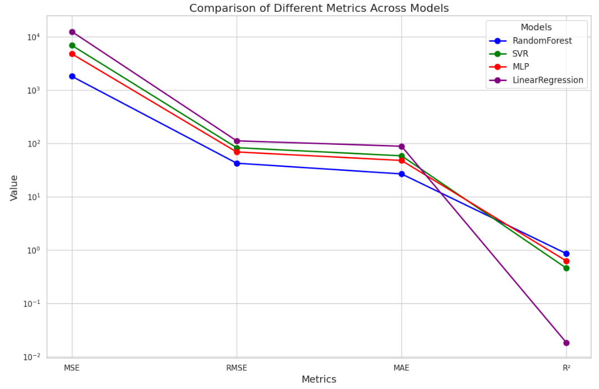

# Airbnb Price Prediction: Comparative Analysis of SVM and MLP Models

## Project Overview

This project investigates European Airbnb prices using the "Airbnb Price Determinants in Europe" dataset. We employ four machine learning models: Linear Regression, Support Vector Machine (SVM), Multilayer Perceptron (MLP), and Random Forest to predict Airbnb prices. The study compares the results generated by these models and optimizes them using feature selection, hyperparameter tuning, and cross-validation techniques.

<div id="bg">
  
</div>  



## Authors

- Yutao Chen ([yutao.chen@estudiantat.upc.edu](mailto:yutao.chen@estudiantat.upc.edu))
- Min Zhang ([min.zhang@estudiantat.upc.edu](mailto:min.zhang@estudiantat.upc.edu))

## Repository Structure

```plaintext
Pytorch-Airbnb-Price/
├── notebooks/
│   ├── PyTorch-LinearRegression-RandomForest-SVR-MLP.ipynb
│   ├── create-dataset-ml-upc.ipynb
├── graphs/
├── models/
│   ├── LinearRegression_best_model.pth
│   ├── MLP_best_model.pth
│   ├── SVR_best_model.pth
├── README.md
├── instructions.txt
```
Random Forest Best Model is too large to upload but it's available at: [Random Forest Best Model](https://www.kaggle.com/models/muchabean/airbnb-price-models-final/TensorFlow2/airbnb/1).

## Getting Started

### Prerequisites

Ensure you have the following libraries installed:

- Python 3.10
- NumPy 1.26.4
- Pandas 2.2.1
- PyTorch 2.1.2+cpu
- Scikit-learn 0.24.2
- Matplotlib 3.3.4
- Jupyter Notebook

You can install the necessary packages using pip:

```bash
pip install numpy pandas torch scikit-learn matplotlib jupyter
```

## Running the Notebooks
- Clone the repository:
```bash
git clone https://github.com/yutao-data/Pytorch-Airbnb-Price.git
cd Pytorch-Airbnb-Price
```

- Open Jupyter Notebook:
```bash
jupyter notebook
```


- Open and run the following notebooks:
PyTorch-LinearRegression-RandomForest-SVR-MLP.ipynb: This notebook implements and trains the machine learning models, performs cross-validation, and evaluates the models.


## Results
The results of the model comparisons are summarized in the LaTeX document included in the repository. The Random Forest model achieved the best performance with an MAE improvement of 69.76% over the Linear Regression baseline.

## Links
[Kaggle: PyTorch-Airbnb-Price](https://www.kaggle.com/code/muchabean/pytorch-linearregression-randomforest-svr-mlp/notebook#Data-Exploration-Process)

## License
This project is licensed under the MIT License - see the LICENSE file for details.

## Acknowledgments
Special thanks to Universitat Politècnica de Catalunya (UPC) and the Erasmus Mundus Big Data Management and Analytics (BDMA) program for their support.